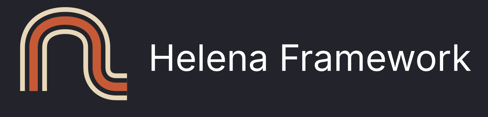
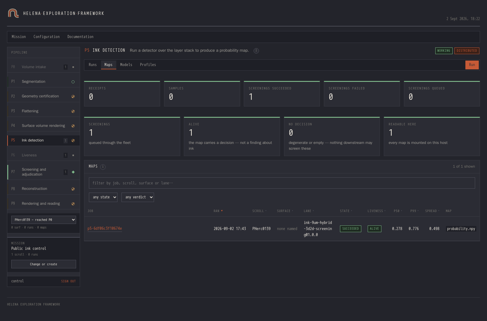
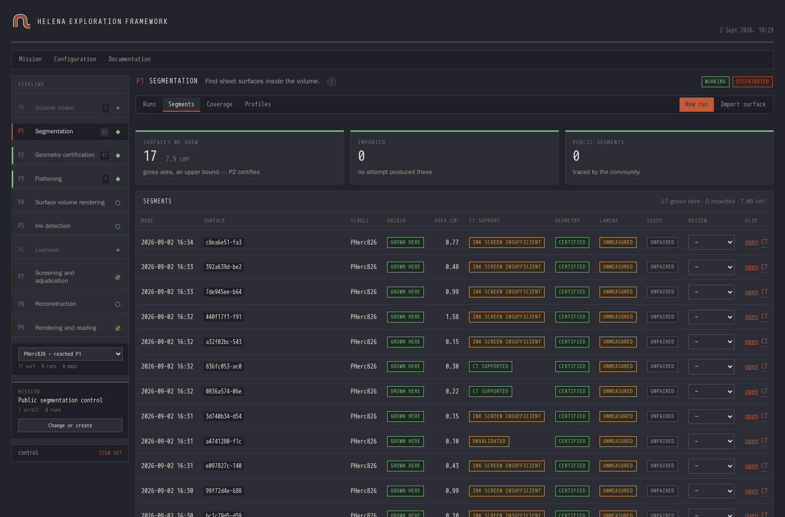

<p align="center">
  
</p>

<p align="center">
  <a href="https://github.com/LimeGS/helena-framework/actions/workflows/audit.yml"></a>
  <a href="https://github.com/LimeGS/helena-framework/actions/workflows/audit.yml"></a>
  <a href="LICENSE"></a>
</p>

An orchestration and evidence layer for the volume → surface → ink → page
pipeline. It re-implements none of it. **VC3D, m7, ScrollFiesta, the Volume
Cartographer flatteners and the ink models stay exactly what they are**, behind
stable adapters — Helena remembers what each was given and what it returned.

**It solves the problems that begin once the methods work.** A campaign produces
thousands of surfaces and detections, across several machines, over weeks. By
then the algorithms are not what costs you time. Reproducing a result a month
later is. So is putting another machine to work without babysitting it, comparing
two lanes fairly, knowing which volume and which checkpoint produced a given
output — and telling a phase that exited zero from one that actually decided
something.

Three things follow from treating those as first-class.

**A tool becomes comparable.** Code, model, parameters, preprocessing and
dependencies are frozen against content: the base image resolves to
`repository@sha256` or the build refuses, checkpoints are pinned by SHA-256, and
profiles, plans and artifacts each carry their own. Hold two lanes against each
other. Replace one without invalidating what came before.

**Hardware becomes poolable.** Trusted teams put their servers and GPUs behind
one auditable queue. It routes work to hardware that can run it, recovers what an
interrupted host was holding, never hands the same row to two workers, and
publishes hash-verified artifacts to shared storage.

**Evidence stays separable.** Geometry certification, CT support, model response
and human review are four distinct judgements, recorded separately. A surface can
be CT-supported and geometrically rejected at once — they answer different
questions, and collapsing them into one number is how a campaign convinces
itself.

**The result is a path from one breakthrough to something a second person can
reproduce, audit and build on.**

## Quickstart

```bash
curl -fsSL https://raw.githubusercontent.com/LimeGS/helena-framework/main/install.sh | sh
```

It asks what this machine should be — the panel alone, or the panel plus CPU or
GPU workers — and puts the panel on `https://localhost:8800`. `--panel`,
`--cpu`, `--gpu` or `HELENA_INSTALL` answer ahead of time; with no terminal to
ask on it installs the panel, which runs no phase. See [Deploying](#deploying)
for the first account. **Needs** `git`, Docker with **Compose v2**, port 8800,
and 6 GB free *where Docker stores images* (`docker info --format
'{{.DockerRootDir}}'` — often not `$HOME`); the user running it must reach the
daemon, so `sudo usermod -aG docker "$USER"` and a new login, or run it under
`sudo`. **Not** needed: Node, Python, CUDA, a GPU — the frontend compiles inside
the image build and the panel runs on CPU.

---

Built for the [Vesuvius Challenge](https://scrollprize.org). MIT licensed.
`NOTICE.md` states what this project claims and what it does not; read it
before quoting any number from here.

---

## The pipeline

Ten phases, defined once in `framework/contracts/pipeline_phases.json`. The
panel, the queue, the job schemas and the in-app documentation are all generated
from that file, so a phase cannot mean one thing in the UI and another in the
worker.

| | | |
|---|---|---|
| **P0** | Volume intake | Freeze which CT volume, and at what physical scale |
| **P1** | Segmentation | Find sheet surfaces inside the volume |
| **P2** | Geometry certification | Is this a physically plausible lamina? |
| **P3** | Flattening | Unroll it, keeping the coordinate map |
| **P4** | Surface volume rendering | Sample the CT along the normal → layer stack |
| **P5** | Ink detection | Run a detector → probability map |
| **P6** | Liveness | Does that map carry a decision at all? |
| **P7** | Screening and adjudication | Probability map → verdict about text-like structure |
| **P8** | Reconstruction | Stitch segments into one continuous sheet |
| **P9** | Rendering and reading | Compose the sheet into a readable page |

P2 and P6 are gates, not transformations.

Several phases have more than one way of doing the work, and the choice is a
**lane** the job records rather than a setting somebody remembers: P1 grows a
surface or fits a spiral through the whole scroll, P4 renders through tifxyz or
bridges a legacy PPM onto a newer rescan, and P5 has five adapters across 23
profiles and 32 pinned checkpoints. A run names its lane, so two results are
comparable or visibly not.

<p align="center">
  
</p>

P5 on a real deployment. Each run names its lane and normalization; `MATCHES` is
the profile contract holding, `ALIVE` the liveness verdict — the column that
exists so a uniform map cannot pass as a result.

## How that is enforced

**`checkpoint_path` is a runtime input, never provenance.** A worker handed a
file whose digest is not the profile's fails the job instead of using it.

**Liveness is asked explicitly.** A detector producing a uniform map exits zero
and writes a file. Liveness classifies it — ALIVE, DEGENERATE, EMPTY — and a P5
job finishing without one is recorded as failed. Every ink lane computes it, and
one that does not fails the suite.

**Claims expire.** `FOR UPDATE SKIP LOCKED`, a lease with a deadline, a bounded
attempt count, and a filter on the capability the job declares — so a dead host
returns its work without an operator and a CPU box is never handed GPU work.

**Publication is atomic and origin-tagged.** Surfaces are staged then promoted,
never written in place, and the totals separate what this fleet grew from what
was imported. Summing the table was wrong in the flattering direction.

**Deploys verify themselves.** After bringing the stacks up, the deploy checks
each container against the image it built, by resolved ID rather than tag, and
exits non-zero otherwise.

Phases implemented elsewhere are registered in `framework/registries/` and
vendored under `framework/vendored/` with a `VENDOR.json` recording source,
commit and a per-file hash. Only technique is imported; findings stay at the
source.

---

## Deploying

The Quickstart line clones, builds and starts what you chose, checking first
what is illegible from inside Docker: a full disk surfaces as `apt-get` exiting
100 about `/var/cache/apt`, a compose v1 shim as a YAML error about a valid key,
a busy port only after the build. It refuses a machine that already runs Helena
— or merely still has its volumes, which outlive `compose down` and, if written
by another user, fail from inside uvicorn as `PermissionError` on the
certificate. `HELENA_ADOPT_VOLUMES=1` proceeds anyway.

Read it before you run it; `curl -fsSLO` then `less` is the better habit. What
it wraps is no secret: `git clone`, `docker compose -f
containers/compose/platform.compose.yaml up -d` for the panel, and
`containers/deploy-platform.sh nogpu|gpu` for workers. Nothing is published, so
every image is built where it runs.

Then claim the first account. Opening the panel offers a form for it; from a
shell on that host:

```bash
curl -sk https://localhost:8800/api/session/bootstrap \
  -H 'Content-Type: application/json' \
  -d '{"username":"you","password":"at-least-ten-characters"}'
```

`-k` because the certificate is self-signed; the log prints its fingerprint.
That endpoint answers only on loopback and closes permanently once an account
exists — being first through the door is not a way in. Later accounts are made
under **Users**; there are no roles, so an account is the whole boundary.

**Object storage is optional and off by default** — artifacts go to a volume on
the panel host, and `HELENA_BACKUP_S3` is only for off-site copies.

### Workers

Phases need workers and P5 needs a CUDA device.

```bash
containers/deploy-platform.sh nogpu   # segmentation, flattening, reconstruction
containers/deploy-platform.sh gpu     # adds ink detection and surface QC
```

On first run the deploy writes `config/*.env` from the templates, never touching
what you put there: in the checkout, git-ignored, yours to delete — nothing
privileged, nothing left in `/etc`. Object-storage credentials go on the panel
instead, so a worker starts from a database URL alone.

Neither profile needs anything external: the deploy builds what it runs, Volume
Cartographer **compiled from source** — cloned at the commit its lock pins and
checked against that commit's tree hash. Expect an hour or two, and more for
`gpu`. `provision-host.sh` is for a *second* machine joining an existing fleet.

A worker off the panel's host needs a machine token: mint one under **Users →
Machine tokens** and set `HELENA_PANEL_TOKEN`. It reaches the artifact endpoints
and nothing else, revocable on its own.

---

<p align="center">
  
</p>

Surfaces from P1 with the four judgements kept apart: origin, CT support,
geometry verdict, human review. A surface can be `CERTIFIED` and `UNVALIDATED`
at once — they answer different questions.

## Where to look next

Everything else is in the panel, under **Documentation**:

- **Tutorial** — one pass through all ten phases: what to press, how long it
  takes, how to tell it worked.
- **User guide** — every control on every page, and when to leave it alone.
- **Developer reference** — contracts, profiles, receipts, versioning, and how
  to put your own tool into a phase.
- **API reference** — the HTTP surface, from the routes themselves.
- **[PHerc0826 golden run](docs/golden-runs/pherc0826-2026-08-01/README.md)** —
  an end-to-end evidence dossier, merge through ink screening to a negative.

Those are generated partly from the contracts the code runs on, so they cannot
drift from the deployment in front of you — which is why this file is short.

---

## Repository layout

```
framework/contracts/   phase definitions, profiles, receipt schemas
framework/stages/      one directory per stage
framework/vendored/    imported techniques, with provenance
panel/                 FastAPI control plane and React frontend
containers/            images, compose files, deploy scripts
tests/                 the suite; runs without a deployment
```

## Contributing

```bash
containers/run-tests.sh tests/ -q --ignore=tests/e2e   # as CI runs it
cd panel/web && npm ci && npx vitest run               # frontend
```

Not `pytest` directly: without a database eighty-odd tests skip silently, and
without a registry configured a build script takes a branch it never takes on
the runner. Both have shipped failures that were green locally. The script
builds the CI image, starts a throwaway postgres and runs the suite in it.

The suite is the specification. Tests are named after the failure they prevent,
and the docstring says what went wrong and why the check is shaped as it is —
several exist because a phase reported success while producing nothing usable.
If you change behaviour, change the test that describes it.

`tests/e2e` needs a running deployment and is skipped without one. It refuses to
pass by skipping everything: a run where nothing asserted is a failed run.

Code follows Semantic Versioning and the current version is in `VERSION`, which
the compose defaults and the build script are checked against. Profiles, runs and
receipts carry their own immutable identities — those are not the platform's
version and never move with it.
