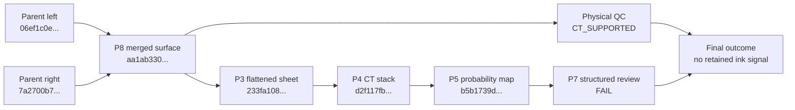

# PHerc0826 production golden run

Status: complete  
Run window: 2026-08-01 to 2026-08-02 UTC  
Machine-readable record: [`evidence.json`](evidence.json)

This dossier records an audited Helena production run from two immutable
surface artifacts through merge, physical quality control, flattening, CT
rendering, ink-probability inference and structured review. It includes the
attempts that failed, the defects they exposed, the corrective revisions and the
content-identical reruns used to close the operational result.

The result is intentionally narrow:

| Question | Verdict |
| --- | --- |
| Did the production path complete end to end? | **PASS** |
| Was the merged surface geometrically certified? | **PASS** |
| Was the surface supported by the source CT? | **PASS: `CT_SUPPORTED`** |
| Was the probability map non-degenerate? | **PASS: `ALIVE`** |
| Was ink, text or a letter accepted? | **NO** |
| Was this a community-confirmed positive control? | **NO** |

`ALIVE` does not mean ink was detected. `CT_SUPPORTED` does not mean ink was
detected. The canonical scientific outcome was
`CT_SUPPORTED_NO_RETAINED_INK_SIGNAL`: physical QC retained zero candidates for
visual review, and the final P7 screen failed.

## Public evidence boundary

This report publishes the public input, scientifically meaningful parameters,
profile and source revisions, measured results, file inventories and SHA-256
content identities. It does not publish private storage locations, hostnames,
worker identities, accounts, local paths, authentication details or deployment
topology.

The opaque surface identifiers below are retained because they bind the N-to-1
lineage without providing access to private infrastructure. Private artifacts are
not downloadable through this dossier; their hashes make the recorded evidence
tamper-evident and allow an authorized holder to verify it.

## Input and lineage

The run used the public PHerc0826 volume:

[`20250821151701-9.362um-1.2m-113keV-masked.zarr`](https://vesuvius-challenge-open-data.s3.us-east-1.amazonaws.com/PHerc0826/volumes/20250821151701-9.362um-1.2m-113keV-masked.zarr)

Helena accepted the requested spelling `PHerc0826` and stored the canonical
sample identifier `PHerc826`. The recorded voxel size is 9.362 micrometres.



The immutable parent-to-child mapping is:

| Artifact | Surface ID | Artifact SHA-256 |
| --- | --- | --- |
| Parent left | `333baa6c-1401-5162-a74f-f854c46a3aab` | `06ef1c0efaa38a473ee4c74fc5a1db26410bdbcc34b0a039da6ffa97317f5564` |
| Parent right | `e35c94e4-a432-5757-a845-274db76f09f4` | `7a2700b78b8ddb5751962dcd385022f7ff795805f4fdfabcc2343740be419ef7` |
| Merged child | `151ea1c0-0308-5fbd-b4d8-2e4f34aa56bc` | `aa1ab33036cfc080452c2388498d27fd14d6fac07c59a00edbfb1573fa992023` |

## Attempt timeline

No failed or cancelled record was removed from the mission ledger.

| Order | Public label | Result | What it established |
| ---: | --- | --- | --- |
| 1 | P8 overlap probe 1 | Refused | Zero real overlap at every tested threshold; disconnected merge rejected. |
| 2 | P8 overlap probe 2 | Refused | Proximity matches existed, but real overlap was zero; disconnected merge rejected. |
| 3 | P8 official | Succeeded | Evidence-backed 1 by 2 pair merged in one attempt. |
| 4 | P3 routing attempt | Cancelled before claim | A CPU-capable job was incorrectly persisted as GPU-required. |
| 5 | P3 schema attempt | Process reported success; flattening failed | Merged manifest schema was rejected and the batch exit status was wrong. |
| 6 | P3 final | Succeeded | Flattened artifact published in one attempt. |
| 7 | P4 original | Succeeded | 33-slice CT stack published. |
| 8 | P5 original | Succeeded with publication defect | Inference was `ALIVE`, but no durable probability artifact was published. |
| 9 | P7 initial | Scientific `FAIL` written | The structured adjudication was missing from the job result. |
| 10 | P7 structured adjudication | Completed with scientific `FAIL` | Exact checks and non-acceptance were persisted. |
| 11 | Physical QC | Completed | Surface reached `CT_SUPPORTED`; zero candidates retained. |
| 12 | P4 reproducibility rerun | Succeeded | Produced the same aggregate artifact hash as the original render. |
| 13 | P5 publication rerun | Succeeded | Reproduced every liveness metric and published a durable map artifact. |

## P8: two surfaces to one certified surface

The merge used `vc3d-tifxyz-merge@1.0.0`, backed by Volume Cartographer source
commit `05dcf0349356bc833670d61e5eca00be58376e35`. The left parent was the
reference, with deterministic RANSAC seed 1729, anchor cap 2000 and zero stripped
columns.

The two preliminary probes are useful negative controls for the merge gate. One
pair had no proximity match, while the other had 376 proximity matches per side
at the loosest tested threshold. Both had zero real-overlap cells. Helena dropped
the unsupported edge and refused to publish a disconnected result. The gate was
not relaxed for the official run.

The official pair passed seam QC:

- 1,000 anchors and 1,000 RANSAC inliers from 1,000 tested correspondences;
- inlier fraction 1.0;
- fitted sigma 0.030958916975155584 voxels;
- 1,000 and 1,003 real-overlap cells on the two parents.

Coverage and continuity were measured separately from RANSAC. At the selected
7.0-voxel threshold, the parents had 1,370 and 1,371 match cells, one real-overlap
component each, purities 0.729927 and 0.731583, and combined score 0.730754. Each
72 by 72 parent had 4,624 valid cells. These values are not a union-area
percentage, and this report does not infer one.

The merged 69 by 69 grid contained 4,490 valid coordinates and 8,712 valid
triangles. Its valid fraction was 0.943079185 and its largest-component fraction
was 0.999777283. Exact testing found zero self-intersections, zero hard defects
and no coverage failures. Geometry therefore reached `GEOMETRY_CERTIFIED`, with
the explicit limitation that certification cannot resolve defects below the
artifact sampling scale.

The merged artifact is bound by SHA-256
`aa1ab33036cfc080452c2388498d27fd14d6fac07c59a00edbfb1573fa992023`.
Its separately published evidence is bound by
`b92a4ab6cee8ccfae6c27c60d4b1f819b32d6a8a8e89008093c21f405043c4f4`.
The full file inventory is in [`evidence.json`](evidence.json).

### Independent synthetic merge control

The production receipt is backed by an independent source-build test at the same
upstream commit. `test_merge_e2e_small` passed 1 of 1 cases in 0.69 seconds. The
complete build required `vc_merge_tifxyz`, `test_merge_e2e_small` and the runtime
dependency `vc_obj2tifxyz_legacy`. The test log SHA-256 is
`830c86f422177fa32b74f78c59bb1abc6f9447c622ce14dffc9112a748647904`.

This is separate test-build evidence. It does not replace the OCI and binary
hashes recorded by the production merge receipt.

## Physical QC: CT-supported, no retained signal

Physical QC ran under
`surface-qc-gp-scroll1-ct-fiber-v3@1.0.0` and completed at
2026-08-01T23:11:02Z. It bound the same merged artifact SHA-256 and produced:

- surface state `CT_SUPPORTED`;
- outcome `CT_SUPPORTED_NO_RETAINED_INK_SIGNAL`;
- 12 components downranked by the CT gate;
- zero components retained for visual review;
- `no_automatic_acceptance=true`.

Its evidence manifest has SHA-256
`a3f9a1f501b441616f61566aadbffcc2132bcf29afc3f41c6c3535f5b64410ad`.
The manifest binds 158 files totalling 12,562,833 bytes. All 158 files were
fetched and rehashed against the manifest with zero mismatches.

The QC receipt also exposed a provenance defect. Its environment-supplied
`code_commit` recorded a stale revision after a direct container restart. The
receipt was not rewritten. For this historical run, the executed content remains
bound by the adapter, checkpoint and CT-gate hashes in `evidence.json`. Revision
`8645ea1428b4c49d6d045946248328303b95a327` corrected direct-restart revision
stamping for future receipts.

## P3: flattening

The first P3 enqueue was never claimed because a CPU-capable flattening job had
been marked as requiring a GPU. It was cancelled before execution. Revision
`d3fedba8c23ded0e0e45a6f4127b902315526d30` corrected the routing contract.

The next attempt reached the worker but exposed two additional defects. The
adapter rejected `campaignx.merged_tifxyz_artifact_set.v1`, and the batch command
returned exit code zero despite the scientific state `FLATTENING_FAILED`.
Revision `7c83d3d845db3ec2ca5ebd54eca3298be55a52a0` added the merged schema to the
closed allowlist while preserving inventory and digest verification, and made an
operational flattening failure return a nonzero exit status.

The final attempt used `flatten-abf-v1@1.0.0`, 10 iterations and downsample 1. It
completed in 11.2 seconds:

| Measurement | Input | Flattened |
| --- | ---: | ---: |
| Grid | 69 by 69 | 68 by 68 |
| Valid triangles | 8,712 | 8,450 |
| Area | 1.529045521 cm² | 1.454200463 cm² |

The area ratio was 0.951051125 against a required floor of 0.8. The published
artifact SHA-256 is
`233fa1084161acf38c91aeec583a174fca6e38b210023ebeaf4cc4cb71b977ff`.
Every file and digest is listed in [`evidence.json`](evidence.json).

P3 ran with `allow_unvalidated=true` because physical QC was still waiting in a
FIFO queue. That exception was explicit in the receipt. It allowed downstream
work to proceed, but it did not authorize final acceptance. The golden run was
held open until the later physical-QC result reached `CT_SUPPORTED`.

## P4: surface-normal CT rendering

P4 rendered 33 numerically ordered uint8 TIFF slices from the flattened sheet at
1.0 scale and 1.0 slice step. The normal direction decision was recorded as
`flip_normals=false`. Each slice is 1,360 by 1,360 pixels; together the TIFFs
contain 19,398,712 bytes. The central slice spans the full uint8 range from 0 to
255.

The first run completed in 30.0 seconds. After the artifact-integrity changes,
the official reproducibility rerun completed in 26.7 seconds. Both produced the
same aggregate artifact SHA-256:

`d2f117fbd46b710c6b1e8fcc0570b2da08d605d69cc81287d4942c9110b281b3`

All 33 rerun slices were downloaded and rehashed with zero mismatches. Their
individual hashes, sizes, sanitized argv and manifest identity are recorded in
[`evidence.json`](evidence.json).

Rendering from the flattened sheet adds an interpolation relative to rendering
directly from the certified TIFXYZ. This run establishes a reproducible platform
path for that chosen lane; it does not establish equivalence between those two
rendering approaches.

## P5: non-degenerate probability map

P5 used `timesformer-gp-scroll1-screening@1.1.0` with a checkpoint bound by
SHA-256
`490a98f9491e1180274ed3a0c0a9c611d73a0109c0e0c0fbba1097562a972488`.
The source spacing was 9.362 micrometres and the model training spacing recorded
by the profile was 7.91 micrometres. The checkpoint declares
`target_overlap_known=false`, so this remains diagnostic screening rather than
external validation.

The liveness result was `ALIVE`:

| Metric | Value |
| --- | ---: |
| Valid pixels | 1,014,685 |
| p50 | 0.1552122384 |
| p99 | 0.5939670110 |
| Standard deviation | 0.0857581431 |
| p99 minus p50 | 0.4387547725 |
| Fraction near 0.5 | 0.0145454008 |

These metrics show that the map is not blank, saturated or constant. They do not
show that the map contains ink.

The original run produced these measurements but did not publish a durable map
artifact. Revisions `d768306bfbcb141cdf345de9b0509e8552e9e7ff` and
`6f18ad78f8f8fa04c03b0a932ed7b1c994e0fb97` made artifact publication part of
the success contract and made P5 fail when publication fails.

The rerun reproduced every liveness metric exactly and published four hash-bound
files totalling 15,558,929 bytes. Their aggregate SHA-256 is
`b5b1739d6ee70730c075886e65aeda9d47121091eaa4d84de189cb2cc271605c`.
All four files were rehashed with zero mismatches.

## P7: structured scientific review

P7 reviewed the probability map with SHA-256
`d5d6489192d73928059ba3e1425f941904723fff60826cdbbf670b03aa1f8c85`.
That is also the map published by the corrected P5 rerun, so the adjudication is
bound to content rather than to the original job identity.

The first review wrote `FAIL` to its output but did not retain the structured
adjudication in the mission result. Revision
`cb87f6191501081eeb0569cec1a21e59f55d80e2` made a scientific `FAIL` a valid,
persisted completed outcome. The rerun recorded:

| Check | Result | Value | Threshold |
| --- | --- | ---: | ---: |
| Non-degenerate map | Pass | not blank, saturated or constant | n/a |
| Structure | Fail | 0.00319355 | 0.13 |
| Letter energy | Fail | 0.15526866 | 0.225 |
| Contrast bimodality | Fail | 0.69206301 | 0.885 |
| Render-family signal | Skipped | insufficient surrounding context | n/a |

The overall P7 verdict is `FAIL`. This is not an operational pipeline failure. It
is the recorded scientific screening outcome for this map.

## Defects found and closed

| Finding | Correction | Closure evidence |
| --- | --- | --- |
| Unsupported P8 pairs could have been mistaken for pipeline failures. | Preserve them as fail-closed overlap probes; do not relax the gate. | Both disconnected merges were refused before publication. |
| P3 was routed as GPU-required. | `d3fedba8c23ded0e0e45a6f4127b902315526d30` | New P3 record was CPU-claimable and completed. |
| P3 rejected merged manifests and returned a false process success. | `7c83d3d845db3ec2ca5ebd54eca3298be55a52a0` | Closed schema validation remained intact; final flattening published successfully. |
| Historical QC restart provenance could be stale. | `8645ea1428b4c49d6d045946248328303b95a327` | Future direct restarts receive the live revision; historical receipt remains immutable. |
| P5 success did not require a durable probability artifact. | `d768306bfbcb141cdf345de9b0509e8552e9e7ff`, `6f18ad78f8f8fa04c03b0a932ed7b1c994e0fb97` | Rerun reproduced metrics and published a four-file hash-bound artifact. |
| P7 omitted the structured scientific outcome. | `cb87f6191501081eeb0569cec1a21e59f55d80e2` | Rerun persisted every check and the overall `FAIL`. |

## Final assessment

The golden run is an operational end-to-end pass. Helena preserved exact N-to-1
lineage, refused unsupported merges, published a geometry-certified child,
flattened it, rendered a deterministic 33-slice CT stack, produced a durable
non-degenerate probability map, completed physical QC and preserved a structured
negative review outcome.

It is also an honest scientific negative for this selected surface. The surface
is CT-supported, but physical QC retained no candidate and P7 did not pass its
text-like screening checks. No automatic acceptance occurred, and there is no
claim of ink, text, letters or a First Letters submission.

The missing validation is a separate end-to-end run on a community-ground-truthed
surface with known ink or letters. That positive control must prove that the same
production path retains and surfaces a known signal. It cannot be inferred from
this run.

## Verifying this record

Validate the machine-readable evidence locally:

```sh
python3 -m json.tool docs/golden-runs/pherc0826-2026-08-01/evidence.json >/dev/null
```

`evidence.json` contains the complete public P8 and P3 inventories, all 33 P4
slice hashes, the P5 probability-artifact inventory, QC manifest identity,
attempt history, corrective revisions and the exact final verdicts.
